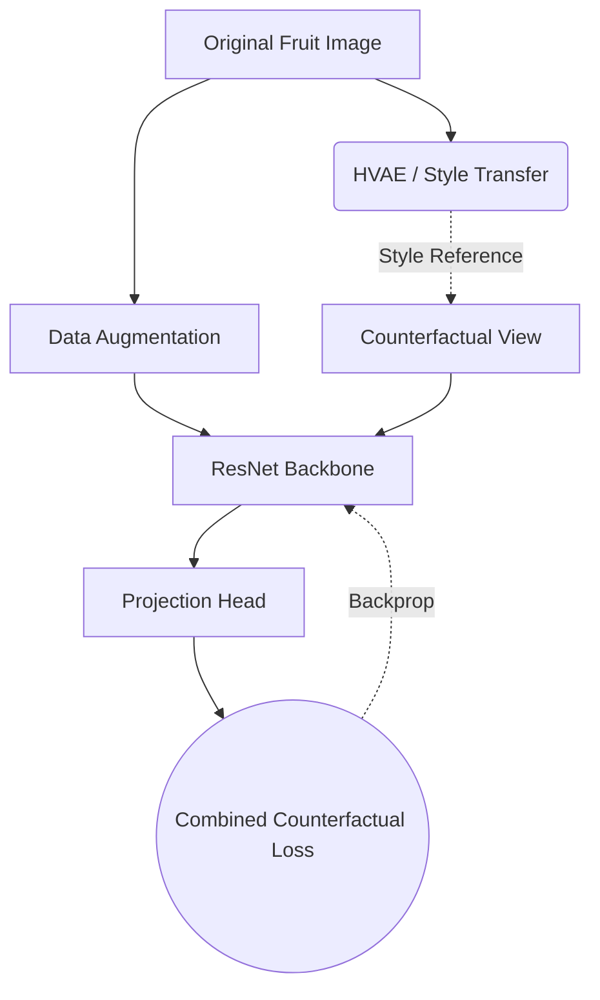

<div align="center">
  <h1>🍎 Contrastive Fruits (CF-SimCLR) 🍏</h1>
  <p><i>A Self-Supervised Contrastive Learning Framework for Robust Domain-Invariant Fruit Representation</i></p>
  
  
  
  

</div>

---

## 📖 Overview

**CF-SimCLR** (**C**ounter**f**actual **Sim****C**ontrastive **L**earning of **R**epresentations) leverages style transfer techniques—including a custom **Hierarchical Variational Autoencoder (HVAE)**—to generate counterfactual styled views of training images. This forces the encoder to ignore domain-specific noise (like smartphone camera signatures) and focus solely on the core features of the fruits.

<details>
<summary><b>🔍 See the Architecture Pipeline (Mermaid Diagram)</b></summary>


</details>

---

## 📂 Repository Roadmap

Navigate the codebase using the categorized components below:

### 🧠 Core Deep Learning Modules
| File | Description |
|---|---|
| `dataset.py` | 📦 `FruitStyleDataset` class. Handles data loading, augmentation, and supplying original + counterfactual views. |
| `hvae.py` | 🎨 The **Hierarchical Variational Autoencoder (HVAE)** used to encode and generate distinct image styles. |
| `ResNet.py` |    The main ResNet backbone implementation used for the contrastive learning encoder. |
| `models.py` | 🏗️ A routing module exposing `get_backbone` (bridges compatibility with older scripts). |
| `losses.py` | 📉 `combined_counterfactual_loss` optimizing representations via InfoNCE + styled counterfactuals. |
| `utils.py` | 🛠️ Miscellaneous utility and helper functions. |

### 🚀 Training Scripts
<details open>
<summary><b>Click to expand/collapse script details</b></summary>

- **`train.py`**: The primary pipeline script. Supports combining original images with stylized counterfactuals (HVAE or Reinhard).
- **`train_hvae.py`**: Pre-trains the Hierarchical VAE solely on style domain images to learn the style latent space.
</details>

### ⚖️ Evaluation & Downstream Tasks
- **`fine_tune.py`**: 🔥 End-to-end fine-tuning of the pre-trained backbone on supervised fruit classification data.
- **`linear_probe.py`**: Trains a simple linear classifier on top of frozen representations to test feature quality.
- **`eval_probe.py`**: Evaluates the trained linear probe or fine-tuned models.
- **`generate_centroids.py`**: 🎯 Computes & saves class feature centroids (`.pt` models) for distance-based/few-shot algorithms.

### 🔬 Analysis & Preprocessing
- **`compare_histograms.ipynb`**: 📊 Jupyter Notebook to visualize color histograms of different datasets, proving the domain shift that CF-SimCLR conquers.
- **`rename_dataset_images.py`**: 🗂️ Batch-renaming and organizing raw dataset images prior to training.
- **`requirements.txt`**: 📜 Standard dependencies.

---

## 💾 Checkpoints & Saved Models

> **Note:** Directory paths below map to the locally saved `.pt` output weights generated during training.

* 📁 `cfsimclr_checkpoints/` - Saved contrastive learning backbones.
* 📁 `hvae_checkpoints/` & `hvae_checkpoints2/` - Outputs for the HVAE style models.
* 📁 `linear_probe_best/` - Best weights for downstream linear probes.
* 📁 `unsup_triplet/` - Weights related to unsupervised triplet training methods.

---

## ⚡ Quick Start

Follow these steps to spin up the CF-SimCLR pipeline:

### 1️⃣ Install Dependencies
```powershell
pip install -r requirements.txt
```

### 2️⃣ Pre-train the HVAE *(Skip if already trained)*
Learn the style latent space before contrastive training:
```powershell
python "contrastive-fruits\train_hvae.py" --content-root "Datasets" --style-root "Apple_dataset_splits\train" --epochs 20 --batch-size 16 --lr 1e-3 --save-dir "D:\Study materials\Year 2\SEGP\Code\contrastive-fruits\hvae_checkpoints2" --device cuda --samples-per-epoch 5000 --pair-mode random --perc-weight 50000 --kld-weight 1e-5 --content-perc-weight 2
```

### 3️⃣ Train the CF-SimCLR Backbone
Run the primary contrastive learning script bridging the dataset and the HVAE styles:
```powershell
python contrastive-fruits\train.py --fruit-root "Datasets" --style-root "Apple_dataset_splits/train" --epochs 300 --batch-size 32 --style-method hvae --hvae-ckpt "D:\Study materials\Year 2\SEGP\Code\contrastive-fruits\hvae_checkpoints\hvae_epoch_20.pt" --save-dir "D:\Study materials\Year 2\SEGP\Code\contrastive-fruits\cfsimclr_checkpoints" --device cuda
```

### 4️⃣ Evaluate (Linear Probe/Fine-tuning) (Use the testing dataset in Kaggle)
Freeze the backbone and test classification accuracy:
#### Linear Probe
```powershell
python contrastive-fruits\linear_probe.py --fruit-root "D:\Study materials\Year 2\SEGP\Code\Dataset, Angle Variable" --ckpt-dir "D:\Study materials\Year 2\SEGP\Code\ckpt_epoch_100.pt" --epochs 20 --batch-size 64 --lr 0.001 --device cuda --balance "none" --seed 43
```
#### Fine-tuning
```powershell
python contrastive-fruits\fine_tune.py --fruit-root "D:\Study materials\Year 2\SEGP\Code\Datasets" --probe-ckpt "D:\Study materials\Year 2\SEGP\Code\contrastive-fruits\linear_probe_best(base_simclr).pt" --simclr-ckpt "D:\Study materials\Year 2\SEGP\Code\contrastive-fruits\ckpt_epoch_100(base_simclr).pt" --epoch 20 --device cuda --save-dir "D:\Study materials\Year 2\SEGP\Code\fine_tuned_models
```

---
<div align="center">
  <i>Developed for domain-invariant computer vision applications in agricultural environments.</i>
</div>
